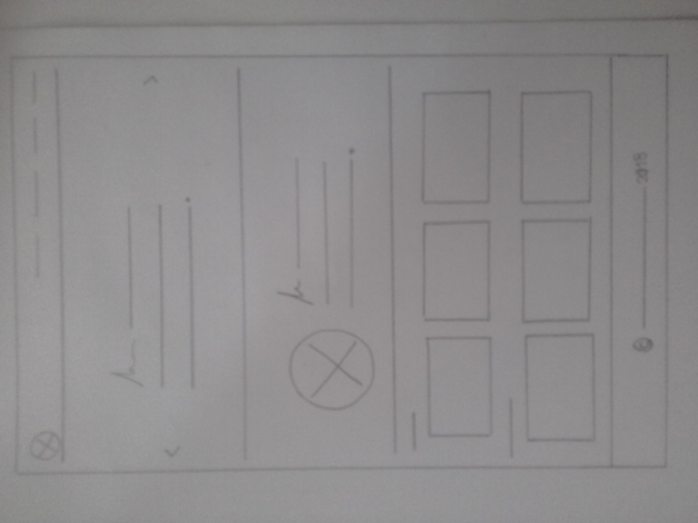

# Portafolio.

## Objetivo:

+ Diseñar una página web que contiene información acerca de mí, trabajos realizados e información de contacto. 

## UX Design:

Se realizó un primer sketch de la página en versión desktop.

